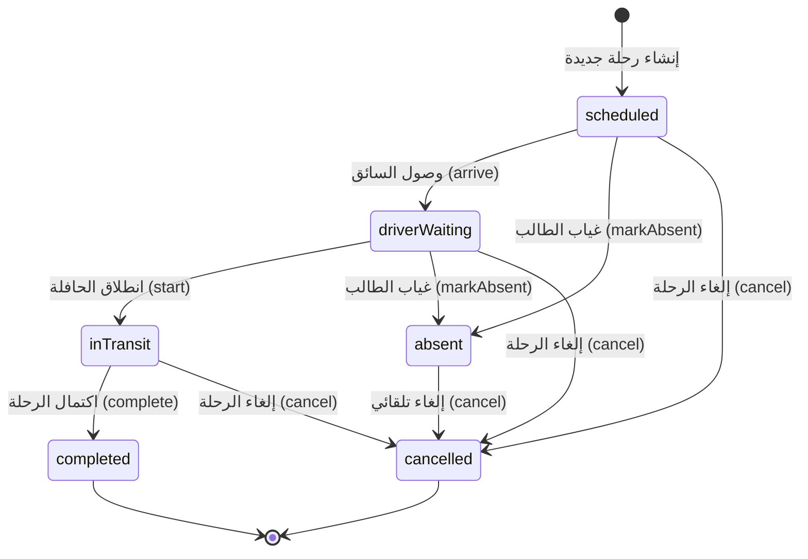
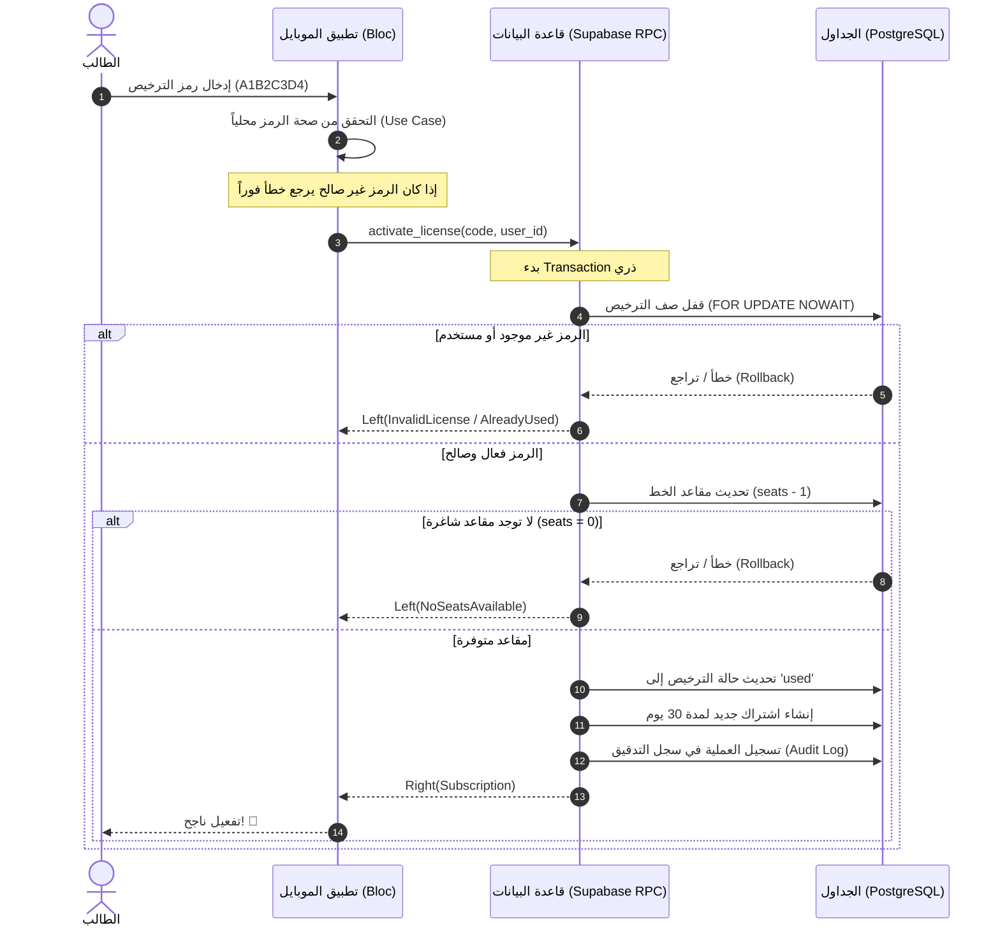

# 🚌 منصة سير | Sayr v3

> **نظام نقل ذكي متكامل ومفتوح المصدر مخصص لطلاب الجامعات في العراق.**
> يربط الطلاب بسائقي حافلات النقل الجامعي عبر نظام تراخيص مسبق الدفع، مع تتبع مباشر للرحلة وجدولة ذكية للخطوط بأقل تكلفة تشغيلية ممكنة.

---

## 🗺️ الفهرس السريع

1. [✨ الميزات الرئيسية](#-الميزات-الرئيسية)
2. [🎨 نظام التصميم والهوية البصرية](#-نظام-التصميم-والهوية-البصرية)
3. [⚙️ البنية المعمارية وهيكل المشروع](#%EF%B8%8F-البنية-المعمارية-وهيكل-المشروع)
4. [🔒 المنطق البرمجي الجوهري](#-المنطق-البرمجي-الجوهري)
5. [🚀 دليل البدء والتشغيل](#-دليل-البدء-والتشغيل)
6. [🛠️ أوامر بيئة التطوير (Melos)](#%EF%B8%8F-أوامر-بيئة-التطوير-melos)
7. [📈 معايير الجودة وضمان الأمان](#-معايير-الجودة-وضمان-الأمان)
8. [📄 التراخيص والمراجع](#-التراخيص-والمراجع)

---

## ✨ الميزات الرئيسية

- **تتبع مباشر وحي (Real-time GPS Tracking)**: تتبع موقع الحافلات على الخريطة أثناء الرحلة بدقة عالية وزمن استجابة منخفض.
- **نظام تراخيص مسبق الدفع ذري (Atomic Seat Licensing)**: تفعيل اشتراكات الطلاب عبر رموز ترخيص مع ضمانات قوية لمنع الحجز المزدوج أو ضياع المقاعد.
- **آلة حالة الرحلة الصارمة (Trip FSM)**: إدارة انتقالات حالات الرحلة بمرونة وأمان لمنع التداخل أو التغيير غير المصرح به.
- **خرائط مجانية 100% (Zero Map Costs)**: استخدام خرائط متجهة حديثة بدون الحاجة لمفاتيح برمجية مدفوعة وبأداء ممتاز.
- **دعم كامل للغة العربية والاتجاه من اليمين لليسار (Native RTL)**: واجهة مستخدم مصممة خصيصاً للمستخدم العربي.
- **قاعدة بيانات محلية تدعم العمل بدون إنترنت (Offline-first Cache)**: تخزين ومزامنة البيانات محلياً لضمان سرعة التطبيق واستقراره.

---

## 🎨 نظام التصميم والهوية البصرية

تم بناء واجهة Sayr v3 بناءً على معايير **Material 3** الحديثة لتقدم تجربة مستخدم متميزة، مرنة وجذابة بصرياً.

### 🎨 لوحة الألوان الأساسية (Color Tokens)

| اللون | القيمة الست عشرية (HEX) | الاستخدام وتوجيه الواجهة |
| :--- | :---: | :--- |
| **الرئيسي (Primary)** | `#1E5BFF` | اللون المهيمن للأزرار التفاعلية والعناصر النشطة والمؤشرات. |
| **الثانوي (Secondary)** | `#10B981` | لون مكمل للأزرار الثانوية وحالات الحالات الإيجابية الخفيفة. |
| **النجاح (Success)** | `#22C55E` | تأكيد إتمام العمليات بنجاح، تفعيل الاشتراكات، والرحلات المكتملة. |
| **التحذير (Warning)** | `#F59E0B` | حالات التنبيه، اقتراب موعد انتهاء الاشتراك، والتأخيرات المتوقعة. |
| **الخطأ (Error)** | `#EF4444` | العمليات الفاشلة، إلغاء الرحلات، الحقول غير الصالحة، وحالات عدم الاتصال. |
| **النص الأساسي** | `#111827` | نصوص العناوين والفقرات الأساسية لضمان أعلى مستويات القراءة. |
| **النص الثانوي** | `#6B7280` | التسميات التوضيحية، النصوص المساعدة، والتواريخ الهامشية. |
| **الخلفية (Background)**| `#F9FAFB` | خلفية التطبيق العامة المريحة للعين في النهار. |
| **الأسطح (Surface)** | `#FFFFFF` | البطاقات والمنبثقات والعناصر العائمة فوق الخلفية. |
| **الحدود (Border)** | `#E5E7EB` | خطوط الفصل الناعمة والحدود الدقيقة بين العناصر لتنظيم المحتوى. |

### 📐 شبكة المسافات والهوامش (Spacing Grid)

نلتزم بنظام مسافات نسبي يعتمد على مضاعفات الرقم 8 لضمان اتساق الواجهات:

* `xxs` (2.0) | `xs` (4.0) | `sm` (8.0) | `md` (16.0) | `lg` (24.0) | `xl` (32.0) | `xxl` (48.0)

### ✍️ الخطوط وأنظمة الكتابة (Typography)

* **Cairo (العناوين والواجهات)**: خط عصري وحديث يعطي وزناً ممتازاً وجمالية للواجهات والعناوين الرئيسية.
* **Noto Naskh Arabic (النصوص الأساسية)**: لقراءة مريحة للمقالات والتعليمات الطويلة وتفاصيل الرحلات.
* **IBM Plex Sans Arabic (النصوص التقنية)**: مخصص لعرض البيانات والأرقام والتوقيتات البرمجية.

### ↩️ فلسفة دعم العربية (RTL First Philosophy)

التطبيق يدعم اللغتين ولكن تم بناؤه بهيكلية **RTL-First** حيث:
1. يتم تجنب استخدام `left` و `right` في الـ Layout واستبدالها دائماً بـ `start` و `end` (مثل `EdgeInsetsDirectional.only(start: 16)`).
2. تعكس الاتجاهات والأيقونات البرمجية تلقائياً حسب اتجاه لغة الجهاز لضمان عدم حدوث تشوهات بصرية.
3. محاذاة النصوص التلقائية تعتمد على الـ `Directionality` الديناميكي للنظام.

---

## ⚙️ البنية المعمارية وهيكل المشروع

يتبع مشروع Sayr v3 هيكلية **Clean Architecture** الموزعة داخل مستودع متعدد الحزم (Monorepo) تتم إدارته بواسطة **Melos**:

```
sayr/
├── apps/
│   ├── mobile/                  # تطبيق الهاتف الذكي (Flutter/Dart - Android & iOS)
│   └── admin/                   # لوحة التحكم الإدارية (React + Vite + Tailwind)
├── packages/
│   ├── core/                    # طبقة Domain نقية (الكيانات، واجهات المستودعات، آلة الحالة)
│   ├── data/                    # طبقة البيانات (اتصال Supabase، النماذج، الكاش المحلي عبر Drift)
│   └── ui_kit/                  # نظام التصميم الموحد (المكونات البصرية المشتركة والسمات والألوان)
├── supabase/                    # إعدادات وقواعد وقدرات السيرفر الخلفي (Migrations, Edge Functions)
├── docs/                        # وثائق التطوير وقرارات البنية المعمارية (ADRs)
└── tools/                       # برمجيات مساعدة للتحقق من جودة الكود والتهيئة
```

### 🎯 سياسة حالات الاستخدام (Use Cases Policy)

لتقليل التشعب والملفات عديمة الفائدة، لا نلتزم بإنشاء Use Case لكل عملية بسيطة، ونتبع السياسة التالية:
* **الاتصال المباشر**: يسمح للـ Bloc باستدعاء الـ Repository مباشرة للعمليات البسيطة (مثل جلب قائمة خطوط لا تحتاج لمنطق إضافي).
* **إنشاء Use Case**: يتم فقط في الحالات التالية:
  - **التكرار**: إذا كان المنطق يُستخدم في أكثر من Bloc.
  - **التعقيد**: إذا كان منطق العمل يحتوي على أكثر من 5 أسطر برمجية غير تافهة.
  - **التركيب**: العمليات التي تتطلب دمج عدة مستودعات في وقت واحد (Transactions).

---

## 🔒 المنطق البرمجي الجوهري

### 1️⃣ آلة حالة الرحلة (Trip State Machine - FSM)

تم تطوير آلة حالة صلبة ومغلقة (Finite State Machine) لضمان أن الرحلات تسير في مسارات منطقية تمنع حدوث أخطاء تشغيلية أو تلاعب من السائق أو المستخدم.

#### مسار انتقالات الحالات



> [!IMPORTANT]
> يتم حماية هذه الانتقالات برمجياً في تطبيق Dart (Core FSM) ويتم التحقق منها وتأكيدها أيضاً على مستوى قاعدة البيانات (SQL Constraint Protection) لضمان عدم حدوث تلاعب عبر الـ API.

---

### 2️⃣ التفعيل الذري للتراخيص (Atomic License Activation)

لتفادي مشكلة P0 في الإصدارات السابقة (نقص المقاعد قبل نجاح الاشتراك أو العكس)، تم بناء نظام تفعيل ذري مبني بالكامل على مستوى PostgreSQL Transactions:



---

### 3️⃣ نظام الخرائط وتحديد المسارات (Maps & Routing)

للحفاظ على تكلفة تشغيلية قدرها **$0 شهرياً**، نعتمد بالكامل على الحلول الحرة والمفتوحة المصدر:

* **عرض الخرائط والـ Vector Tiles**: نستخدم مكتبة `maplibre_native` بالتعاون مع سيرفرات **OpenFreeMap** لعرض الخرائط المتجهة بسلاسة ودقة فائقة وبدون أي حدود استخدام أو مفاتيح خريطة.
* **رسم المسارات (OSRM)**: نستخدم محرّك رسم المسارات المجاني OSRM لحساب المسافات وتوليد الخطوط الرابطة بين المحطات وتحديثها ديناميكياً مع حركة الحافلة.

---

## 🚀 دليل البدء والتشغيل

### 📋 المتطلبات الأساسية

* بيئة عمل **Flutter SDK 3.22+**
* بيئة عمل **Dart SDK 3.4+**
* أداة إدارة المشاريع **Melos** (للتثبيت: `dart pub global activate melos`)
* نظام إدارة قواعد البيانات **Supabase CLI** (اختياري للعمل على الـ Local Database)

### 🛠️ خطوات التثبيت والتشغيل المحلي

1. **استنساخ المستودع**:
   ```bash
   git clone https://github.com/wisam79/sayr.git
   cd sayr
   ```

2. **إعداد ملف البيئة**:
   قم بنسخ ملف الإعدادات التجريبي وتعديل القيم بما يناسب سيرفر Supabase الخاص بك:
   ```bash
   cp .env.example .env
   ```

3. **تثبيت حزم الاعتماديات (Bootstrap)**:
   استخدم Melos لربط جميع الحزم الداخلية تلقائياً وتثبيت الاعتماديات بضغطة زر واحدة:
   ```bash
   melos bootstrap
   ```

4. **توليد الكود التلقائي (Code Generation)**:
   لتوليد نماذج Freezed ونظام الـ DI وقواعد الكاش Drift:
   ```bash
   melos run build:runner
   ```

5. **تشغيل التطبيق**:
   * لتشغيل تطبيق الموبايل:
     ```bash
     cd apps/mobile
     flutter run
     ```
   * لتشغيل لوحة الإدارة:
     ```bash
     cd apps/admin
     npm run dev
     ```

---

## 🛠️ أوامر بيئة التطوير (Melos)

يوفر ملف `melos.yaml` مجموعة من الأوامر الجاهزة لتسهيل عملية التطوير والاختبار:

| الأمر | الوظيفة والهدف |
| :--- | :--- |
| `melos bootstrap` | يقوم بتثبيت اعتماديات `pub get` وربط الحزم محلياً. |
| `melos run build:runner` | يقوم بتوليد الكود المكتوب عبر حزم الجيل التلقائي لمرة واحدة. |
| `melos run build:runner:watch` | يراقب التغييرات في الملفات ويقوم بتوليد الكود ديناميكياً أثناء كتابته. |
| `melos run test` | يقوم بتشغيل جميع اختبارات الـ Unit & Widget في جميع الحزم. |
| `melos run test:coverage` | تشغيل الاختبارات مع توليد تقرير بنسبة تغطية الكود. |
| `melos run analyze:strict` | فحص صارم لكفاءة وجودة الكود والتحقق من التنسيقات والخلو من Warnings. |
| `melos run lint:fix` | تطبيق حلول تلقائية لمشاكل التنسيق والتنبيهات البرمجية. |
| `melos run clean:full` | تنظيف عميق وحذف لجميع ملفات البناء المؤقتة في كافة الحزم. |

---

## 📈 معايير الجودة وضمان الأمان

يلتزم فريق تطوير Sayr بمعايير هندسية صارمة لضمان بيئة عمل آمنة وكود مستدام:

- **أمان الأنواع (Type Safety)**: يمنع استخدام نوع البيانات `dynamic` تماماً خارج نطاق الـ DataSource. جميع النماذج مبنية على `freezed` الصارم.
- **عزل طبقة الـ Backend**: يمنع منعاً باتاً استدعاء Supabase مباشرة من الواجهات الرسومية (UI). جميع الطلبات تمر بالـ Repository والمستودع المخصص لها داخل حزمة `data`.
- **معالجة الأخطاء الوظيفية (Functional Error Handling)**: نعتمد على مكتبة `fpdart` واستخدام صنف `Either<Failure, T>` للتعامل مع الاستثناءات بشكل صريح بدون التسبب بانهيار التطبيق.
- **حماية البيانات المحلية**: لا يتم تخزين الكلمات السرية أو رموز التحقق في الذاكرة المشتركة المفتوحة. يتم استخدام `flutter_secure_storage` لتخزين الرموز الحساسة.
- **تغطية الاختبارات**: يفرض مسار الفحص التلقائي (CI) نسبة تغطية اختبارات لا تقل عن **70%** كحد أدنى للمنطق البرمجي والبيانات (النسبة الحالية الإجمالية للمشروع هي **71.50%**).

---

## 📄 التراخيص والمراجع

* هذا المشروع يخضع لرخصة **MIT License** - راجع ملف [LICENSE](LICENSE) للتفاصيل.
* للمطورين ومساعدي الذكاء الاصطناعي، يرجى قراءة الدليل التوجيهي الصارم [AGENTS.md](AGENTS.md) قبل البدء في تعديل أو كتابة أي كود برمجي.
* لمناقشة قرارات البنية الهندسية، يرجى مراجعة سجل الـ ADRs في المجلد [docs/adr/](docs/adr/).
